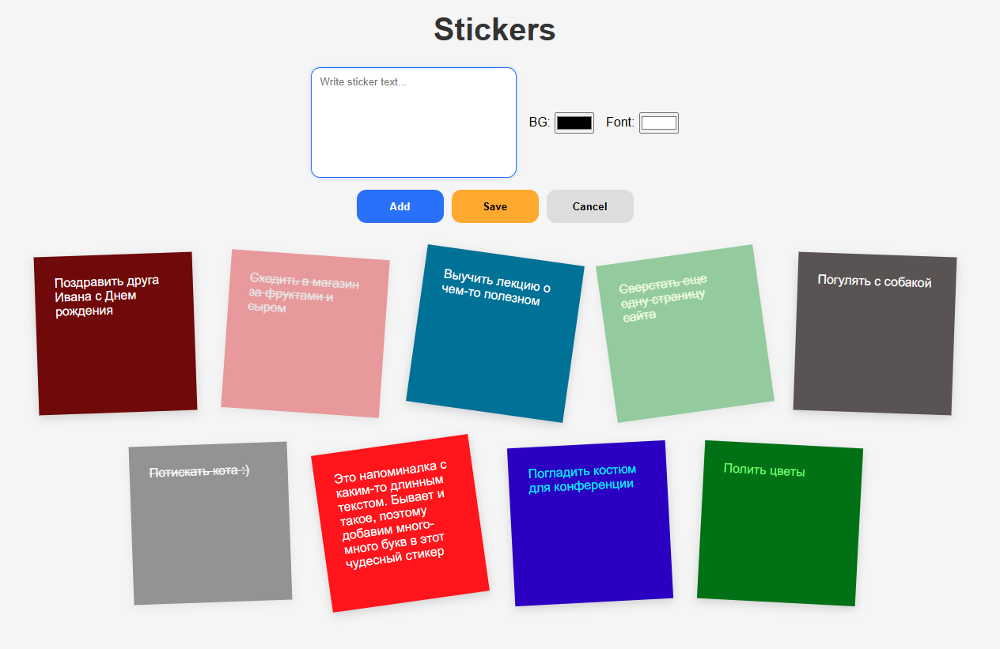

# 📌 Stickers — Мини-приложение для заметок

**Stickers** — это небольшое приложение на чистом **HTML / CSS / JavaScript**, позволяющее создавать удобные визуальные заметки-стикеры с выбором цветов и статусом выполнения.
Проект создан для практики DOM-манипуляций, управления состоянием, работы с LocalStorage и создания интерактивного UI без использования библиотек.

**Демонстрация** - https://nataliyayadykina.github.io/stickersJS/

## ✨ Возможности

### 🟨 Создание стикеров

- ввод текста от 3 до 130 символов;
- выбор цвета фона;
- выбор цвета текста;
- автоматический случайный наклон (эффект настоящих стикеров).

### 📝 Редактирование

- клик по стикеру открывает его для редактирования;
- можно изменять текст и цвета;
- все изменения сохраняются в `localStorage`.

### ✔️ Отметка о выполнении задач

- переключение статуса выполнения задачи стикера;
- визуальные эффекты: перечеркивание + прозрачность.

### ❌ Удаление с подтверждением

- перед удалением появляется сообщение о необходимости подтвердить действие;
- удалённый стикер исчезает из интерфейса и localStorage.

### 💾 Сохранение данных

Все стикеры сохраняются в `localStorage`, поэтому после перезагрузки страницы они остаются на месте.

### 📱 Адаптивность

Приложение корректно отображается:

- на десктопах,
- планшетах,
- мобильных устройствах.

Разметка гибко перестраивается, а панель управления кнопками остаётся аккуратной и удобной.

## 📂 Структура проекта

```
/project
│
├── index.html          # Основная HTML-страница
├── style.css           # Стили (адаптив, анимации, оформление)
├── script.js           # Логика приложения
└── README.md           # Описание проекта
```

## 🚀 Запуск

Просто открой файл в браузере и добавляй, изменяй, удаляй стикеры:

```
index.html
```

## 📸 Скриншоты


